# Engineering 2
arduino projects Q1 engineering 2
Arduino Projects covering LCD screens, potentiometers, LCD Backpacks, photointerrupters and motors
# IntermediateArduino
## LED Blink Revisited
### Description
Use sublime to make an LED blink, and then fade. I used a delay and variable to add and reduce current running through the LED.
### What I Learned
* How to better use loops and variables 
* Refresher on Arduino
### 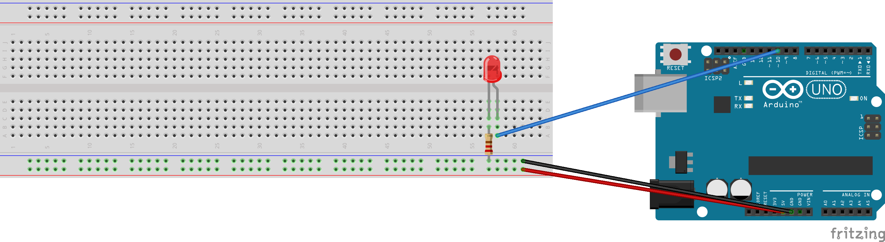
### [Code](IntermediateArduino/Led_Blink_Revisited)
## Hello LCD
### Desciption
This was my first time using an LCD screen, and with a little help pretty quickly I got my screen to display "Hello World." I used https://learn.adafruit.com/character-lcds/wiring-a-character-lcd and code found in the hello LCD module on canvas.
### What I Learned
* How to use sublime 
* Almost all code you need can be found online
### 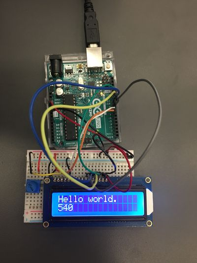
### Credit: Abigail Paquette
### [Code](IntermediateArduino/Hellolcd/HelloLCD.ino/HelloLCD.ino.ino)
## LCD Backpack
### Description
Using an LCD Backpask with an LCD screen for the first time, displaying "Hello World." It was much easier to set up the wiring with the backpack, and I used switch commands to count button clicks.
### What I Learned
* Backpacks make LCD Easier 
* How to use a new tool with an LCD screen
### 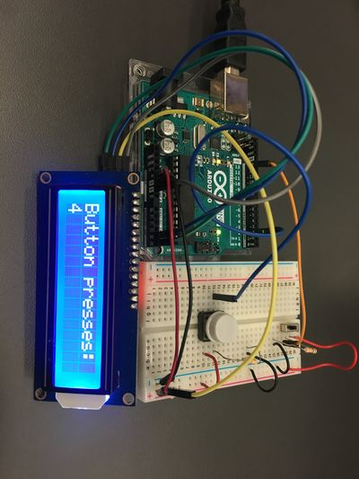
### Credit: Abigail Paquette
### [Code](IntermediateArduino/lcd_backpack/LCD_Backpack.ino/LCDBackpack.ino/LCDBackpack.ino.ino)
## Photointerrupters
### Description
Using and soldering a T-Slot photointerrupter to detect if anything is in the slot. I had some trouble soldering, and melted part of the photointerrupter. It was still mostly functional, and was able to detect when there was something in the t slot.
### What I Learned
* Do not let the pins touch when soldering 
* Be careful with the angle you solder at 
* This would be a helpful project when operating the wheel in a PID box
### 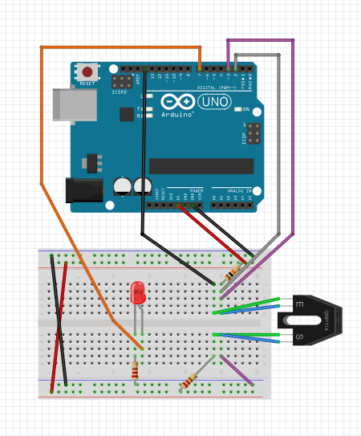
Credit: Abigail Paquette
### [Code](IntermediateArduino/Photointerrupter/photointerrupters.ino)
## Potentiometers
### Description
Use a potentiometer to change LED brightness and display it on an LCD screen. I used a breadboard potentiometer to change the brightness.
### What I Learned
* How to use an LED with an LCD screen and potentiometer 
* All code you need is online
### 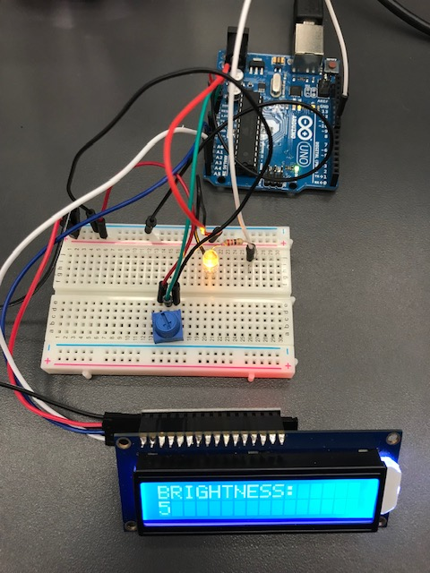
Credit: Abigail Paquette
### [Code](IntermediateArduino/LCD_Potentiometer/LCD_Potentiometer.ino)
## Motor Control
### Description
Use a battery pack and code to control a motor. This became important during my project, and I used analog funtions to spin the motor.
### What I Learned
* How to wire the battery box 
* How to use a motor
### 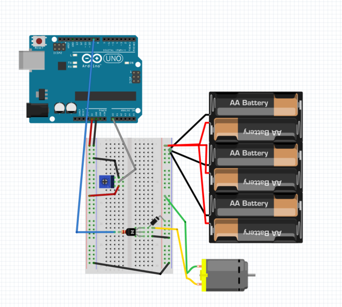
Credit: Abigail Paquette
### [Code](IntermediateArduino/Motor_control/Motor_control.ino)
# Solidworks
## A little practice
### Description
A quick refresher on parts and assemblies. I used mates, fillets, patterns, cuts and extrusions to complete this assignment.
### What I Learned
* How to pattern an extrusion 
* Be careful about what you patter around
### 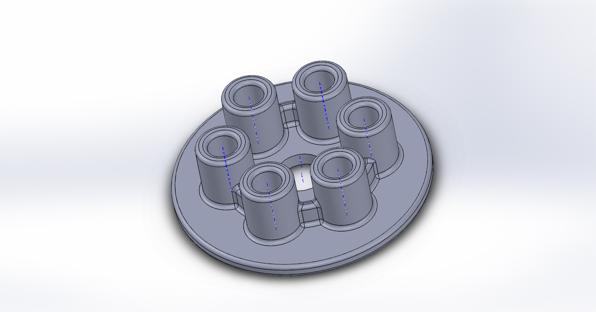
### 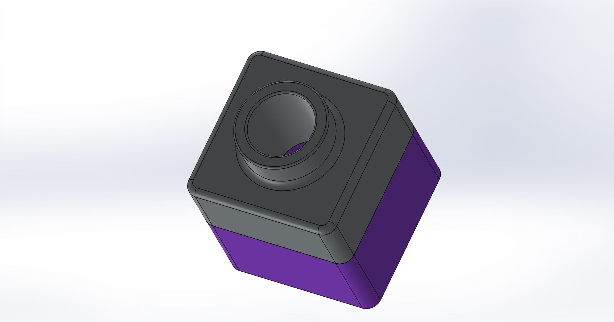
## Sweeps and lofts
### Description
Using sweeps and lofts to make a hammer and a candlestick. Through this assignment, I learned to extrude along a curve to make a hammer and candlestick.
### What I Learned
* How to use sweeps 
* How to use lofts
### 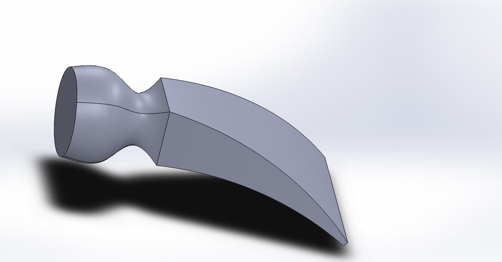
### 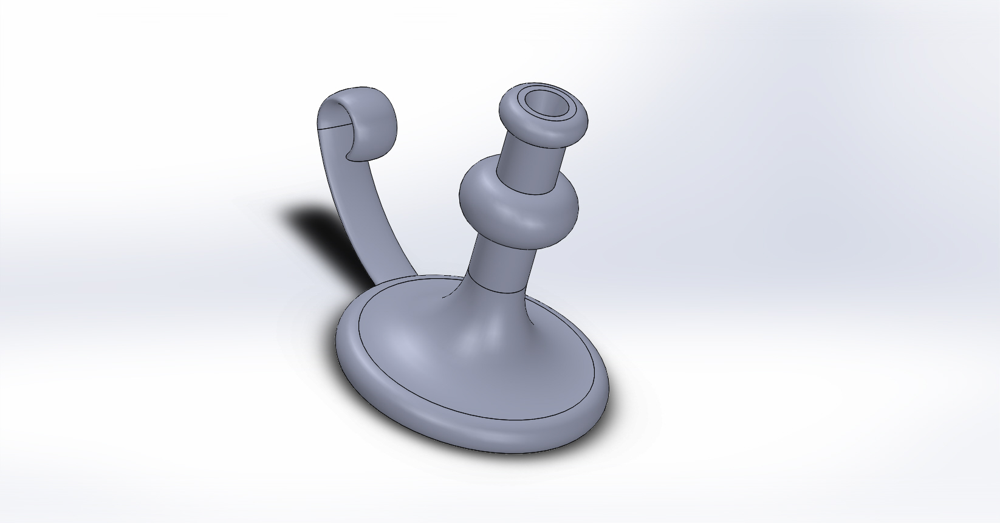
## Design Tables
### Description
Use a design table to make different sized spools. The design table featuree was difficult at first, but I got the hang of it and was able to make the parts and holes.
### What I Learned
* How to use a design table 
* How to use temporary axis
### 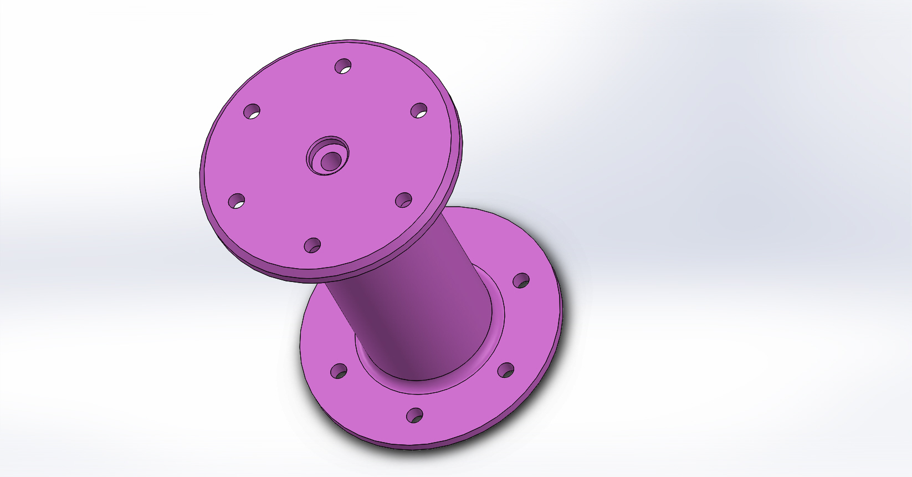
## Advanced Mechanical Mates
### Description
Making 3 configurations and locking them together with mechanical mates. I learned how to use a new type of mate, which will be helpful in the future.
### What I Learned
* How to use a slot mate 
* How to configure color
### 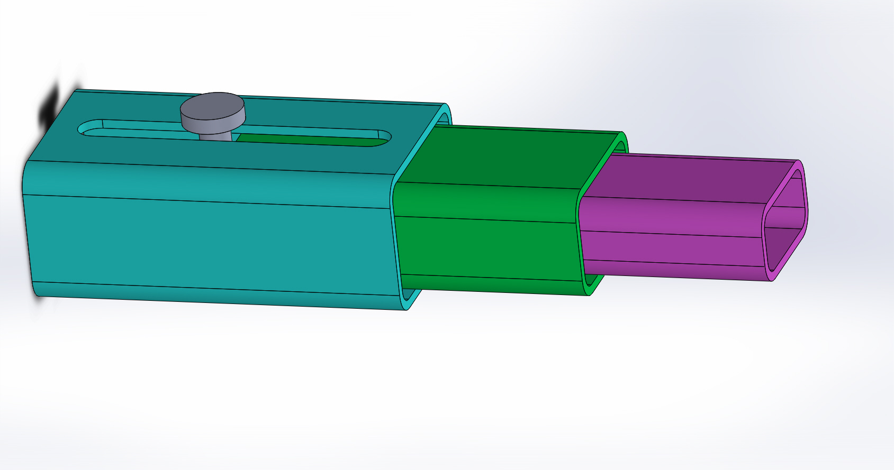
